# Getting started with Git and the Terminal
When developing any application, you'll need the Terminal to perform a range of different tasks. You already have experience with this: in the CS50 IDE, the terminal is how you compile and run your code. But as you are getting into more and more advanced methods and tools, you'll start to need it for more and more tasks.

So, it is important to be familiar with how the Terminal works. That is what we'll be discussing in this section. We'll do so by introducing a tool you'll often use when working on projects: git.

Don't worry, though. We'll stick to the basics for now. But you can do many awesome things with the terminal alone! More on that in the unit on UNIX, later in the course.  

> **Following along** You'll get the most out of this section if you follow along with it on your own device. Try out what we're discussing! If you get stuck, or something doesn't quite do what you were expecting, feel free to ask for help!

 

## Opening a Terminal application
To do anything with a Terminal, first you need to open a Terminal window. This can be done in many different ways, sometimes depending on your OS and the software you're using.

### Opening a Terminal directly in Visual Studio Code
Sometimes, you need the Terminal a lot while coding. In that case, it may be best to open a Terminal window directly in Visual Studio Code. 

**Mac/Linux**

To do so on a Mac or Linux device, simply navigate to Terminal > New Terminal or hit Ctrl + Shift + ` (should be three keys at the bottom-left of your keyboard).

  
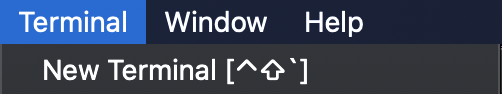
  

**Windows**

On a Windows machine, you need to make sure to open the WSL terminal instead of the Windows command prompt. Once you have enabled WSL (refer back [here](../workshop/windows) if you've forgotten how), hit Ctrl + J to open the WSL Terminal.

  
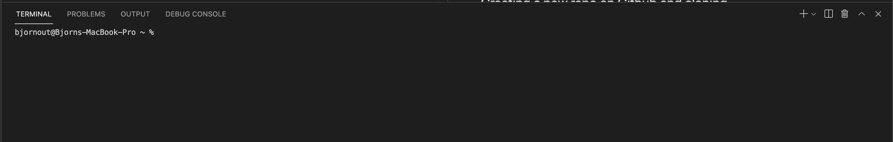
  

Voilà! A brand new Terminal window.

### Opening a separate Terminal window - Mac and Linux
Sometimes, you may want to use a separate window instead. For example, if you have a second monitor and want to make more space for your code. On a Mac or Linux device, you can simply search for 'Terminal' and open the application. A new terminal window will pop up!

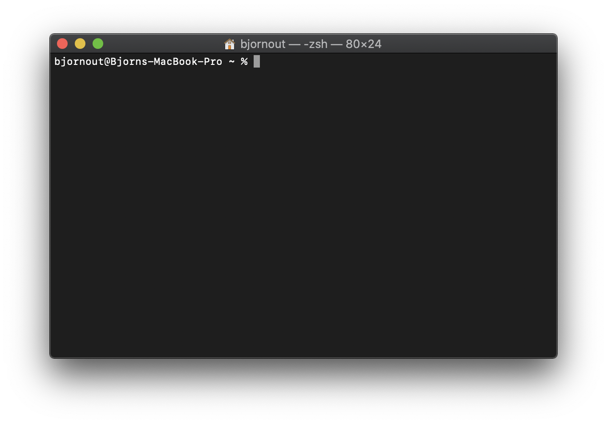

### Opening a separate Terminal window - Windows
Sometimes, you may want to use a separate window instead. For example, if you have a second monitor and want to make more space for your code. On a Windows device, you can open a Terminal window by pressing the Windows Key + R, and then entering 'ubuntu' in the window that appears. After a small wait, a Terminal window should pop up!

## Using `cd` to get to the right spot
When working in a Terminal, you're always working within a certain folder on your device. All the commands you run will run relative to that folder. The selected folder in a Terminal window is called the 'present working directory'. To find out what folder you have selected, simply type the shorthand for that: `pwd`, and press enter.

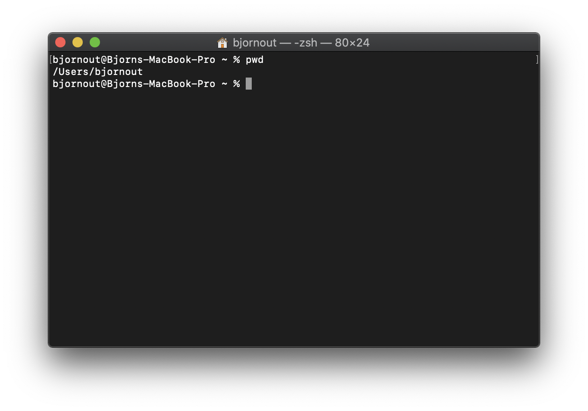

As you can see, it has just dropped me into my user directory when I opened the window. It is really unlikely I'd want to do anything here, so let's navigate elsewhere. To find out what's in our current directory, run the command `ls`.

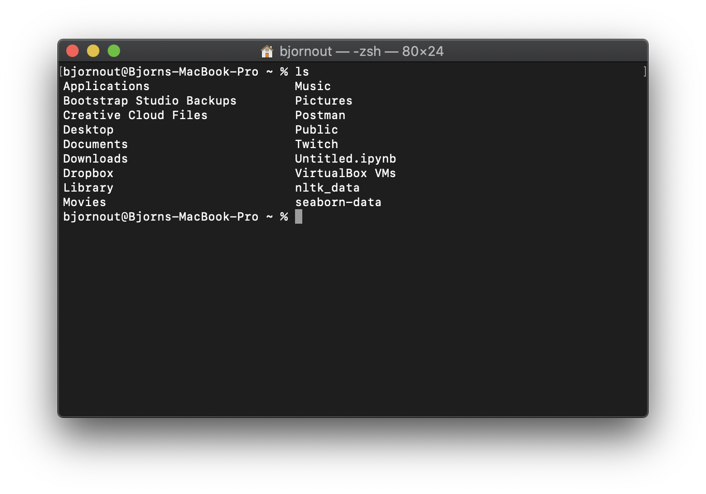

As you can see, there are a lot of folders and files in my user folder. Say I want to run some code stored on my Desktop: we need to navigate there. To do so, run `cd Desktop`. If Desktop isn't one of the folders listed for you: don't worry. Just navigate to any other folder by replacing `Desktop` with the name of that folder.

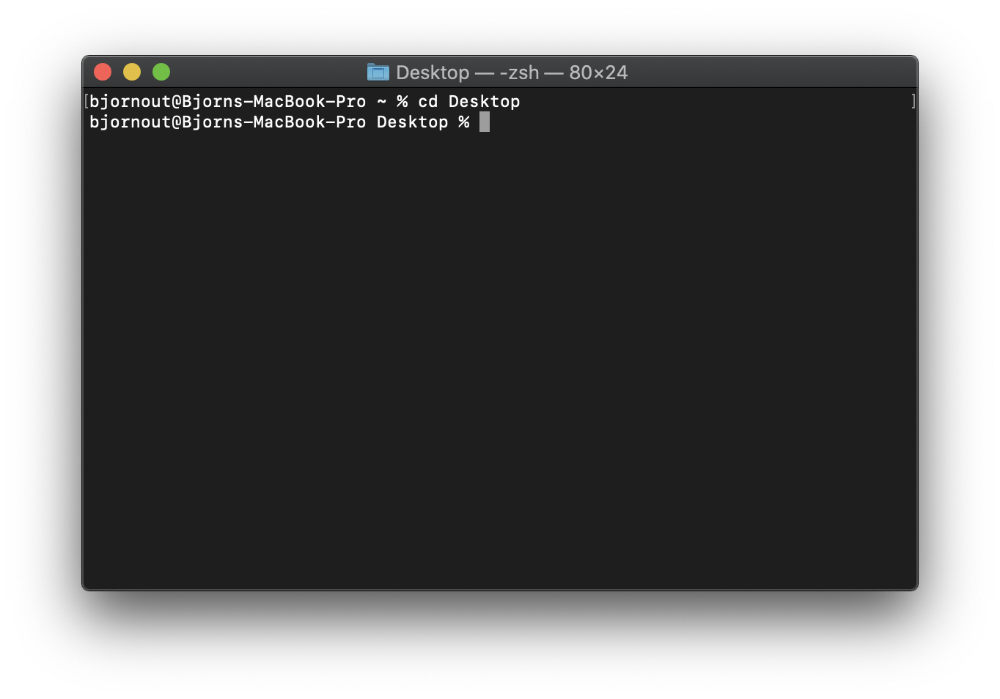

You can now see next to the `%` that I'm at the Desktop. Try running `pwd` to confirm this. Try to find out what folders are located here...

Do notice, however, that any commands you run now are run relative to the Desktop. You cannot, for example, navigate to the Downloads folder by typing `cd Downloads`, as Downloads isn't on the Desktop. You can do so however by typing out the full path: `cd /Users/[yourname]/Downloads` or `cd ~/Downloads` (the `~` always refers to your user directory).

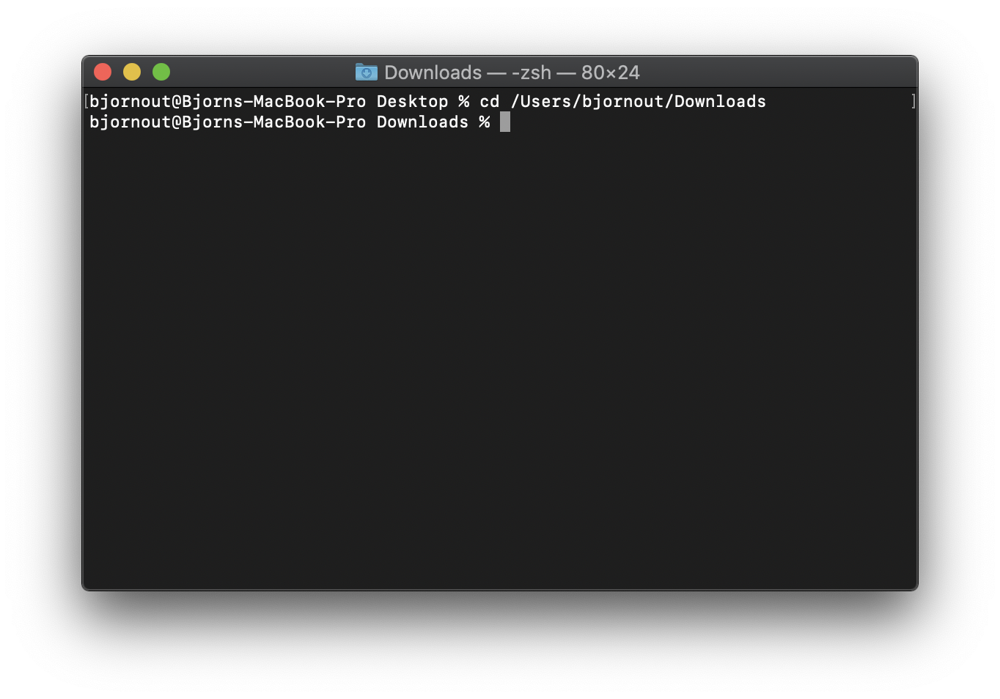

In addition, you can use `..` to refer to one directory higher than your current directory. So when on the Desktop, you could use `cd ..` to return to your user directory. Or even better: use `cd ../Downloads` to navigate directly to Downloads.  

> **Pro tip!** Don't feel like typing out a long path to a directory? Simply drag the folder onto your Terminal from your Finder or Explorer. The full path will apear right away!

 

## Creating a new repo on Github and cloning
Now, let's get started using git. Git is a great tool for managing programming projects, from small projects to enterprise-level applications. It keeps track of all changes, and allows for you to work on a project with a team of people, all while avoiding conlicts as much as possible.

Your code in git is placed in a so-called 'repository'. Within a repository, git keeps track of changes and resolved conflicts. Every repository needs to be hosted somehwere. Ofcourse, you could host it on your own device. If you're going to work with other people, however, this won't work. Most repository's, therefore, are primarily hosted through services like [Github](https://github.com). You should already have an account there. If not, create one now!

Once you log in to Github, you end up in your dashboard. From here, you can create a new repository by hitting the 'New' button on the left of the screen.

  
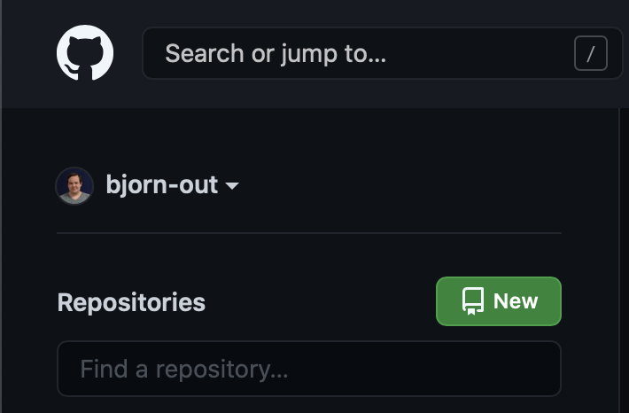
  

Give your repository a name (it must be unique within your account), a description and select whether you want it to be public or private. Public repository's, including all the code in them, can be seen by anyone on the internet. Private repository's can only be seen by the people you add to them. Finally, tick the box next to 'Add a README file'.

  
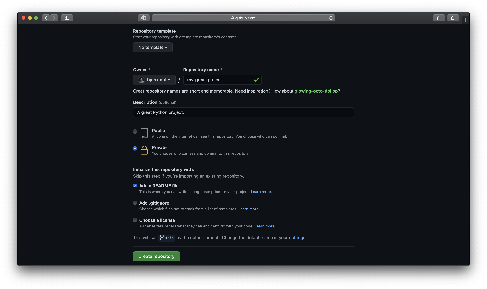
  

You now have a new Github repository. It's empty, apart from the README file. So let's make sure you can actually work on your code within the repository, on your own device. To do so, you must 'Clone' the repository by clicking on the green 'Code' button and copying the URL that appears. 

  
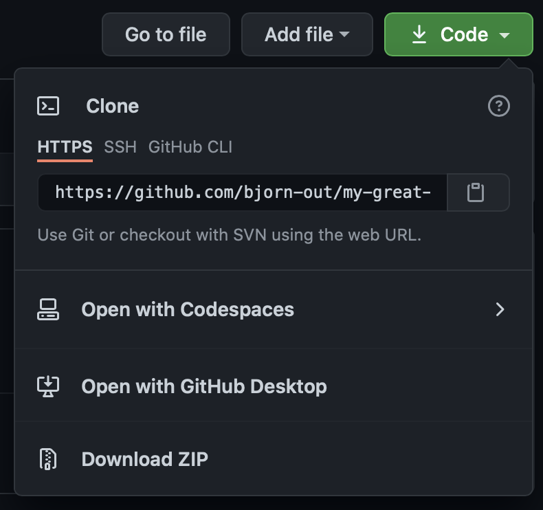
  

Then, in a Terminal window, navigate to a folder where you want your code to live. Then, run `git clone [URL]`, replacing `[URL]` with the URL you just copied. Git should perform some magic, and a new folder with the name of your repository should appear. In there, you'll find the README file from Github!

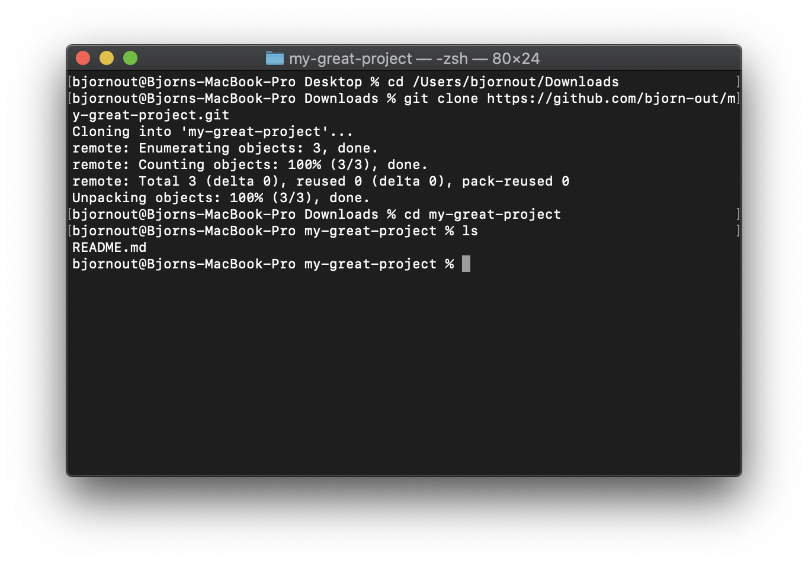

## Updating, committing and pushing
Now, we want to actually host some code on Github. In your Terminal, navigate to the new repository folder with the README in it and enter `touch hello.py`. A new file, named 'hello.py', should appear. Then. write some code in there. I'm just adding some code to ask someone their name, and tell them hello.

  
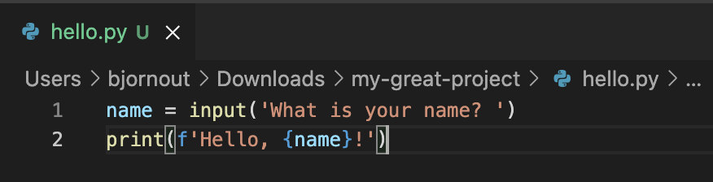
  

Now, we want to tell git that we actually want it to track this file. We can do so by running `git add hello.py` within our repository folder.
  

> **Adding a lot of files?** If you've just added or updated a lot of files, and want to add them all to git, just run `git add *`. All files will be added at once.

 
Now, there are two more steps. By running `git commit`, you will save the changes to your files within your local copy of the repository. You must, however, add a message describing you change. You do this with `-m`, like so: `git commit -m "Hello, world"`.

Finally, we want to synchonize your local repository with the hosted one on Github. Simply type `git push` to achieve this. Now, you can see your brand new file on Github!

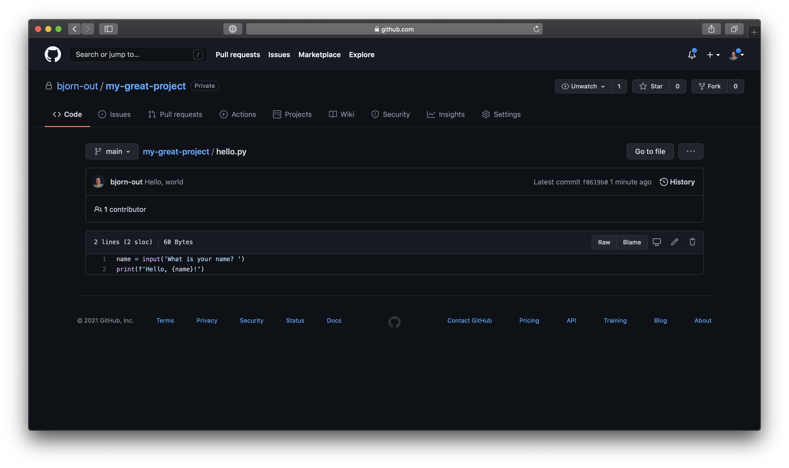

## Pulling changes from GitHub
When working on a project with multiple people, or even when you edit a file yourself through Github, your local repository will probably always be slightly out of sync compared to the one on Github. No worries! To get your local back in sync, simply run `git pull`.

To see how this works, try editing your hello.py file through Github's website. Click on the little pencil icon next to the buttons 'Raw' and 'Blame' to edit a file. Then, run the pull command and it updates like magic:

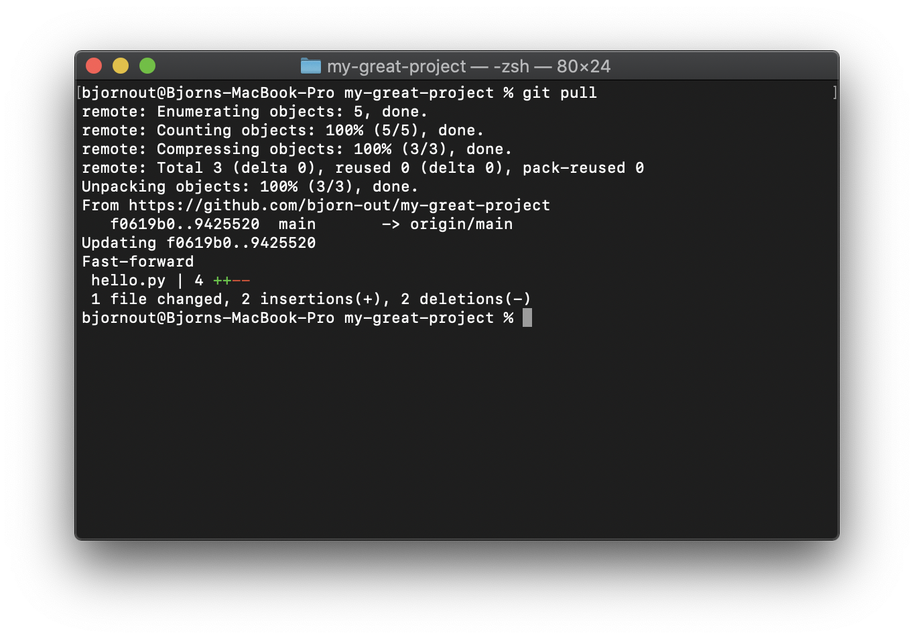

## Creating and solving a merge conflict
Now, this pull only really worked because you didn't also make a change locally. After all, if you're editing the same code in different ways, git can't figure out what you actually mean.

When this happens, this is called a merge conflict, and it is probably the most dreaded thing for anyone using git. But don't worry, we'll tell you how to fix them, and even how to prevent them from happening in the first place.

But first, let's create a merge conflict on purpose. First, change some of your code locally and commit it, but **don't** push yet! Then, change the same line of code through Github's web interface. Finally, try to pull your changes locally.

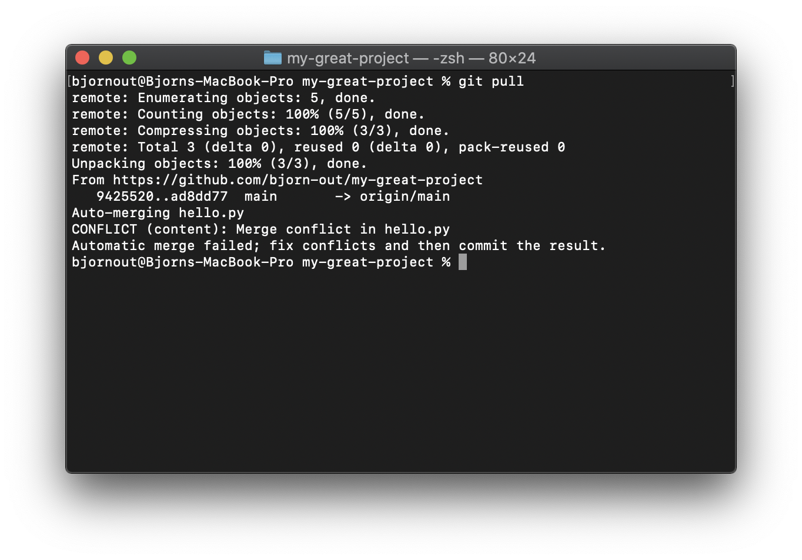

Oh no! The dreaded merge conflict. Let's fix it. If you open your file in VSCode again, you will see a lot of extra stuff has appeared. 

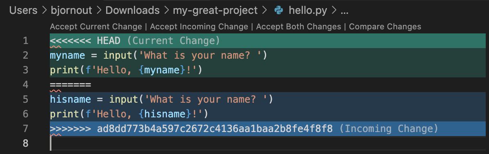

Where it says 'HEAD', you can see your current local change. At the bottom, the change you made on Github. Now, to fix this, edit the file to whatever the code actually should be. In this case, I want to use my local change. So I'm removing the other change, and also the characters that git added.

  
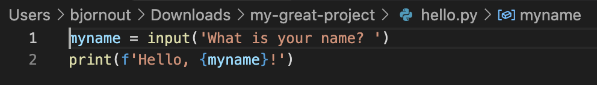
  

Then, finally, commit the changes again. It should go through now! Don't forget to push again.

### Preventing merge conflicts
Ofcourse, it is preferable to just not have any merge conflicts at all. To decrease the likelyhood of encountering one, you may want to consider the following guidelines:

- Even when working alone, pull before you commit, unless you always work from a single computer and never edit on the Github website.
- When starting to work together with others, try to split up your code into smaller files to reduce chances that you will be working near the same lines of code.
- Don't touch code that you don't need to touch. If you want to clean up, discuss with your partners first and preferably do it after everyone has committed any outstanding changes.

But in a way, merge conflicts are inevitable. There will always be times that your work partially overlaps with that of a partner. No worries, just keep practicing!

## Finally...
With git and Github, working on code together becomes much easier. All changes are tracked and conflicts are resolved automatically as much as possible. In addition, you're now more familiar with the Terminal, which is will come in very useful for a variety of different tasks and tools. 

With these things, as with most things programming, practice is the key! So don't hesitiate to explore these tools on your own, and be sure to ask for help if you need any!
