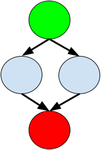

# Cyclomatic complexity

Code quality is more than just code style. Because just that code adheres to a style guide does not mean it is any good. But, code quality is tricky. It means different things to different people, and is notoriously hard to capture in a set of a rules. Instinctively we can recognize bad code when we see it...

    def guess():
        for i in range(52):
            key = ["a", "a", "a", "a"]
            key[0] = LETTERS[i]
            if crack(key):
                return key
            for j in range(52):
                key[1] = LETTERS[j]
                if crack(key):
                    return key
                for k in range(52):
                    key[2] = LETTERS[k]
                    if crack(key):
                        return key
                    for x in range(52):
                        key[3] = LETTERS[x]
                        if crack(key):
                            return key

The code above complies to PEP 8, feel free to check it out with `flake8`. But it is not exactly great code. Over time code quality metrics have been developed to capture that feeling of bad code. One such metric is [McCabe's Cyclomatic complexity](https://en.wikipedia.org/wiki/Cyclomatic_complexity). Cyclometic complexity captures the number of independent linear paths through the code. Here's an example:

### If statements

    0.
    1. if x > 10:
    2.     print("foo")
    3. else:
    4.     print("bar")
    5.

There are two ways this code can be executed, either the condition evaluates to `True` or to `False`. So one path through the code is line `1 -> 2`, and the other path is `1 -> 3 -> 4`. These are linear paths that are also independent from one another, they have a node that the other one does not. So we can say that the cyclomatic complexity for this snippet is `2`. This number is also interesting for testing purporses. Because in order to test the code above, we need at least 2 test cases to touch all lines of code at least once.

More generally, the cyclomatic complexity is based on the control-flow graph of a program. For instance, we can imagine the control flow graph for the if-statement above like so:

The green node is our starting point, line 0. Then there is an if-statement, a fork in the road if you will. And after the if-statement the code will end the same way on the red node representing line 5. This is the formula for Cyclomatic Complexity (`M`) for a single function:

    M = E − N + 2

Where `E` is the number of edges (arrows in the graph), `N` the number of nodes (circles in the graph). In the graph above there are 4 nodes and 4 edges, so if we fill that in we get:

    M = 4 − 4 + 2 = 2

Precisely what we deduced earlier!

### Loops

Okay, now what about loops? Let's take another example:

    0.
    1. for item in items:
    2.    total += item
    3.

We can visualize this in a control flow graph like so:

Again, 4 nodes, 4 edges, that gives us a Cyclomatic Complexity of 2. So for this metric, loops and if-statements are equally complex.

### Nesting

Here is an example of nesting:

    0.
    1. for item in items:
    2.    if item > 10:
    3.        total += 10
    4.    else:
    5.        total += item
    6.

We can visualize this in a control flow graph like so:

In this case, there are 5 nodes, 6 edges, so that gives us a Cyclomatic Complexity of `6 - 5 + 2 = 3`. In other words, adding one additional fork in the road, increases the complexity with `1`.