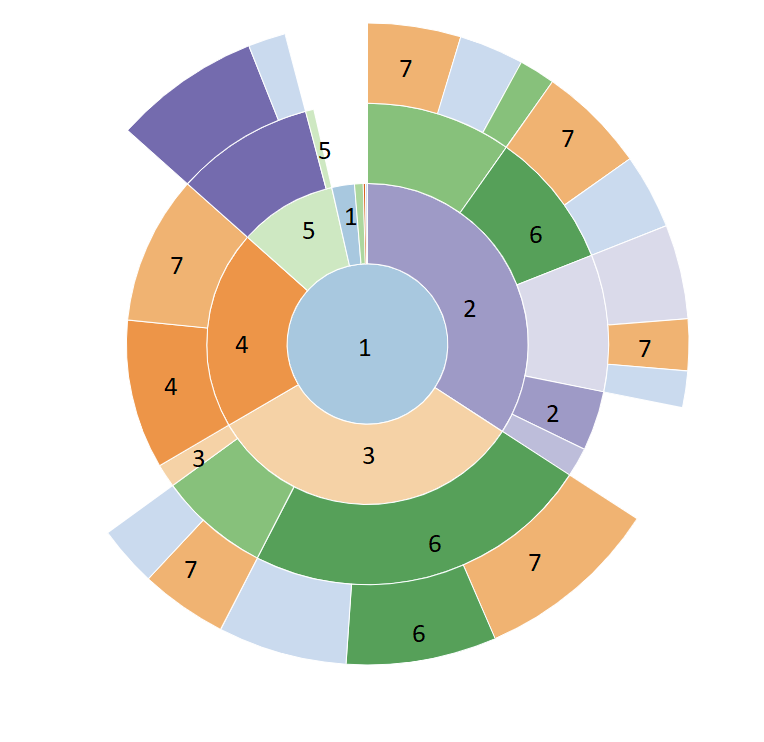

# Profilers: optimize a Sudoku Solver


<https://video.uva.nl/media/Platforms2021%20Profiling%20Intro/0_eao7e3jd>

[The distribution code (download)](sudoku_profiling.zip) contains a functional Sudoku solver and six Sudoku puzzles. This solver can solve any of these puzzles within 15 seconds to a couple minutes on a modern computer. While that may sound fast enough for a solver, it is actually too slow for some tasks, such as automatically generating new puzzles. As generation of puzzles involves solving many different puzzles, most of which are likely to be too easy, imperfect (containing more than one solution) or impossible to solve.

This is where you step in. Your task is to take this solver and make it run faster. To do this you will analyze the program's runtime behavior to find hotspots. Then it is up to you to analyze what is making the code slow, and find creative solutions to make the code run faster. Every step of the way you will want to re-evaluate whether your changes to the code, actually do make the code run faster. Odds are that not every change works out the way you'd expect it to!

## Profiling


<https://video.uva.nl/media/Platforms2021%20Profiling%20Assignment/0_fy9i5u7c>

Theoretical analysis of runtime complexity is a helpful tool to evaluate performance of individual functions, algorithms or generally small pieces of code. However, once the codebase grows it gets increasingly harder to do and it becomes less useful too. Odds are that not every function is equally important to the actual runtime of the code. Because afterall, who knows if a function actually gets called during execution and if so, how many times?

This is where profilers step in. Profilers are programs that run your program to analyze its runtime behavior. Simply put, profilers build a profile of your program while it is running. They keep track of which functions are called, how many times, how much time is spent in them, etc. Through this profile you can get a grasp of what your program is actually doing and spending time on.

> In some cases profilers might also keep track of memory usage of your program, but that is something this assignment does not focus on.

Python comes with a [built-in profiler](https://docs.python.org/3/library/profile.html) called `cProfile`. This profiler can called be called from the command line like so:

```
python3 -m cProfile your_program.py
```

> If unfamiliar, `python3 -m` is simply a way to run a specific module (-m) for that version of `python3`.

Once your program finishes, cProfile will show you the profile in a table like below.

<table cellpadding="0" cellspacing="0" border="0" role="grid" aria-describedby="pstats-table_info">
    <thead>
        <tr role="row">
            <th title="Total number of calls to the function. If there are two numbers, that means the function recursed and the first is the total number of calls and the second is the number of primitive (non-recursive) calls.">ncalls</th>
            <th title="Total time spent in the function, not including time spent in calls to sub-functions.">tottime</th>
            <th title="`tottime` divided by `ncalls`">percall</th>
            <th title="Cumulative time spent in this function and all sub-functions.">cumtime</th>
            <th title="`cumtime` divided by `ncalls`">percall</th>
            <th title="File name and line number were the function is defined, and the function’s name.">filename:lineno(function)</th>
        </tr>
    </thead>
    <tbody>
        <tr role="row" class="odd">
            <td>1</td>
            <td>5.54e-05</td>
            <td>5.54e-05</td>
            <td>11.36</td>
            <td>11.36</td>
            <td>solve.py:1(&lt;module&gt;)</td>
        </tr>
        <tr role="row" class="even">
            <td>10</td>
            <td>0.26</td>
            <td>0.026</td>
            <td>11.34</td>
            <td>1.134</td>
            <td>solve.py:11(solve)</td>
        </tr>
        <tr role="row" class="odd">
            <td>100270</td>
            <td>0.4553</td>
            <td>4.541e-06</td>
            <td>3.875</td><td >3.865e-05</td>
            <td>sudoku.py:45(options_at)</td>
        </tr>
        <tr role="row" class="even">
            <td>354280</td>
            <td>1.905</td>
            <td>5.377e-06</td>
            <td>3.701</td>
            <td>1.045e-05</td>
            <td>sudoku.py:92(column_values)</td>
        </tr>
        <tr role="row" class="odd">
            <td>100280</td>
            <td>0.1791</td>
            <td>1.786e-06</td>
            <td>3.676</td>
            <td>3.665e-05</td>
            <td>sudoku.py:122(is_solved)</td>
        </tr>
        <tr role="row" class="even">
            <td>9189940</td>
            <td>3.02</td>
            <td>3.286e-07</td>
            <td>3.02</td>
            <td>3.286e-07</td>
            <td>sudoku.py:39(value_at)</td>
        </tr>
        <tr role="row" class="odd">
            <td>100270</td>
            <td>1.137</td>
            <td>1.134e-05</td>
            <td>2.271</td>
            <td>2.265e-05</td>
            <td>sudoku.py:70(next_empty_index)</td>
        </tr>
        <tr>
            <td>...</td>
        </tr>
    </tbody>
</table>

> You can hover over each table header to get a better understanding of each statistic

At a quick glance what you see here is how many times each function is called and how much time in seconds is spent within each function. For instance, the function `solve` is called just ten times, whereas `value_at` is called more than nine million times!

But what about time? This is where it gets a little tricky. Functions can call other functions, and it might just be that functions down the line are actually responsible for the time spent. To help you here, cProfile shows both the total time (time spent just within that function) and cumalative time (time spent within that function and all its sub functions). For instance, `solve` has a cumalative time of 11.34 seconds, but its total time is just 0.26 seconds. Meaning, 11.34 seconds of the runtime of this program is the result of a call to `solve`, but only a fraction of that (`0.26` seconds) is from the code of `solve` itself. The remainder (`11.34 - 0.26 = 11.08 seconds`) is all from functions `solve` calls.

Okay, but what functions is `solve` calling? cProfile does not tell you this in the table above. Most likely because that is hard to do in table form. Luckily there is a Python module called [snakeviz](https://jiffyclub.github.io/snakeviz/) that takes a profile from cProfile and visualizes it in the browser like so:



> Note, the numbers aren't shown by snakeviz. That's just a visual aid for those color blind.

The above is just an image, the real thing is interactive. What you see here is a sunburst graph. In the middle is the function `solve`, and each outer layer are functions `solve` calls either directly (the second most inner layer) or indirectly (all other layers). The size of each slice represents the cumalative time spend inside that function. So here you see that `solve` ends up calling four functions directly (2, 3, 4, 5) that are responsible for most if its runtime. Most of these functions then spend their time in other functions too, except for `4` (`next_empty_index`). That one spends about half its time in itself. Which makes sense, because its total time is `1.137` and its cumalative time `2.271`.

The colors in the graph identify a function. You might have noticed all the orange in the graph from number `7`. Turns out, that is the function that was called nine million times (`value_at`). Makes sense, because almost every function in this graph will at some point end up making calls to `value_at`.

## The distribution code


<https://video.uva.nl/media/Platforms2021%20Profiling%20Distro/0_odxtqxlg>

## Optimizing

A profile can tell you which parts of the code contribute most to the overall runtime, but not how or why. This is where you as a programmer step in. It is your job to try and figure out why some parts of the code are taking so much runtime. Then, improve the code so that it runs faster. Not just run faster in theory, but in practice too. You'll do this be reevaluating the code after each improvement. You might just find that a sensible change in theory, does not actually translate to practice.

Note that execution times fluctuate between runs and that a profiler will always add some overhead. Do be sure to run the code sufficiently long (> 10 seconds) before drawing any conclusions.

Here are some tips to get you started, look out for:

- Loops
- [Data structures and their operations](https://wiki.python.org/moin/TimeComplexity)
- Complexity both in big O and big Ω (worst and best case respectively)
- Duplicated or more generally unnecessary function calls
- ...

And here is some inspiration as to what you can try:

- Try to avoid loops where reasonably possible.
- If a function call is expensive, that is takes up a lot of runtime, it might be worth [caching](https://docs.python.org/dev/library/functools.html#functools.lru_cache) its results. Such that a subsequent call can pull from the cache instead.
- Misuse of data structures is a common source of performance penalties. Look out for operations that run in O(n) or worse.
- Besides improving the code within a function, you can also look into reducing the number of calls to the function.
- ...

And finally, some advice:

- If performance does not meaningfully improve and the code quality degrades, the change is not worth it.
- If performance does meaningfully improve, it's a win. Code quality comes second for this assignment.
- Zoom out every now and then. Don't get too caught up in small functions, but think about the program as a whole.
- Get creative. Is searching for an empty spot really needed?

## What to do

Improve the code in seven **different** ways. For each, write down:

- Why you selected that part of the code.
- Why you think that code can be improved.
- What you changed in the code.
- What the performance gain is or isn't. In either case, reflect briefly on why you think the performance does (not) improve.

> Note that the form below does not show your answers after you have submitted this assignment. It's best to keep a copy of your own in case you want to resubmit later!

<textarea name="form[1]" rows="5" required=""></textarea>

<textarea name="form[2]" rows="5" required=""></textarea>

<textarea name="form[3]" rows="5" required=""></textarea>

<textarea name="form[4]" rows="5" required=""></textarea>

<textarea name="form[5]" rows="5" required=""></textarea>

<textarea name="form[6]" rows="5" required=""></textarea>

<textarea name="form[7]" rows="5" required=""></textarea>

## Rules of the game

#### Do

- Change the implementation of functions and methods.
- Change the data structures used within the program, as long as it does not break any other rule.
- Add new functions and methods.

#### Don't

- Change the declaration of existing functions and methods.
- Change the types of parameters or return values of existing functions and methods.
- Change testcases or remove test cases.

## How to Submit

> Before you submit, double check that each of your answers contains: Why you selected that part of the code, Why you think that code can be improved, What you changed in the code, and What the performance gain is or isn't.
