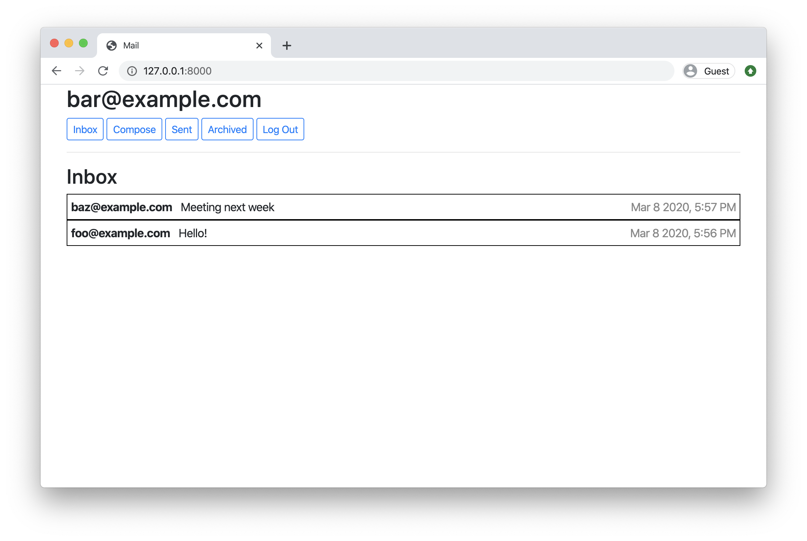
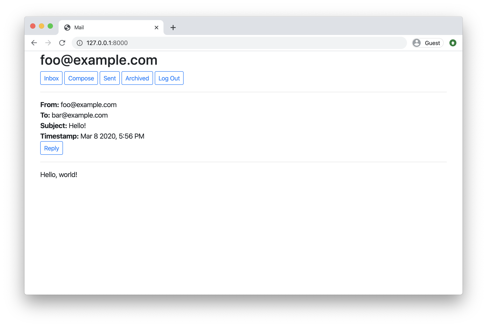

# Mail

Design a front-end for an email client that makes API calls to send and receive emails.

## Getting Started

- Start your project by accepting the assignment on [GitHub Classroom](https://classroom.github.com/a/ktkcpRaC)

- Then immediately submit your repository's URL at the bottom of this page.

- Clone your new repository.

- In your terminal, `cd` into the commerce directory.

- Run `python manage.py makemigrations auctions` to make migrations for the `auctions` app.

- Run `python manage.py migrate` to apply migrations to your database.
