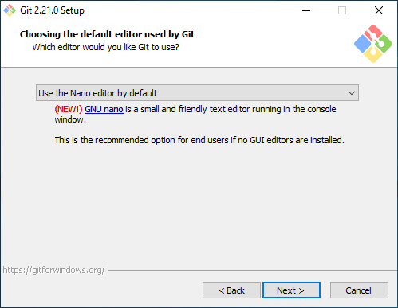

# Windows: Installing

To develop web apps you need some tools on you laptop. This guide helps you with installing al these tools.

## Step 1: Git

Head to [the git website](https://git-scm.com/downloads) and download git for windows.

During the installation change the following options

## Step 2: Sass

Download sass from [GitHub](https://github.com/sass/dart-sass/releases/), `dart-sass-x.xx.x-windows-ia32.zip` for 32-bits Windows and `dart-sass-x.xx.x-windows-x64.zip` for 64-bits Windows.

[Is my windows 32 or 64 bits?](https://www.howtogeek.com/howto/21726/how-do-i-know-if-im-running-32-bit-or-64-bit-windows-answers/) 

Extract the zip you've downloaded

Click "Extract All"

And extract it to `C:\`

If you want to use Sass from the terminal you'll need to add it to you 'PATH'.

1. The first step depends which version of Windows you're using:
    - If you're using Windows 8 or 10, press the Windows key, then search for and
    select "System (Control Panel)".
    - If you're using Windows 7, right click the "Computer" icon on the desktop
    and click "Properties".
2. Click "Advanced system settings".
3. Click "Environment Variables".

4. Under "System Variables", find the `PATH` variable, select it, and click "Edit".

5. Click "New" and "Browse..."

6. Navigate to your `C:\` drive and click "dart-sass"

7. Click (all the) "Ok"-buttons(s) to save the settings

Open "Git Bash" from the Start menu.

Run
    
    echo 'alias sass=/c/dart-sass/sass.bat' >> ~/.bash_profile; source ~/.bash_profile

to make it easier to run `sass`
Now you should be able to use sass, execute `sass --version` in your terminal to verify this.

## Step 3: Python3

Download Python 3.7 from the [Python website](https://www.python.org/downloads/).

Install Python, make sure you check the "Add Python 3.7 to PATH" box.

## Step 4: A Text-editor

Those of you who have taken CS50 are used to working from within the IDE. In this course, we remove those training wheels. This means you have to download and install a text editor on your own computer. Free code editors are [Visual Studio Code](https://code.visualstudio.com/), [Atom](https://atom.io/) or [Sublime Text](https://www.sublimetext.com/). We would recommend Visual Studio Code, but you are free to choose another editor if you like.

## Troubleshooting
Ran into trouble? Contact the staff! It’s important to get started quickly. You only have to do the above once, so get help now and you’ll be set for the remainder of the course!
